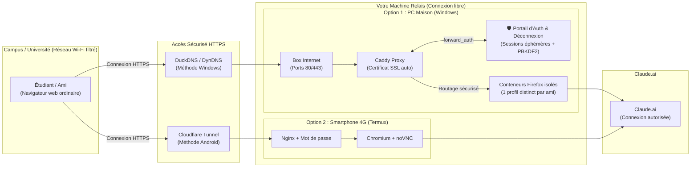

# ClaudeCampusUnlock 🔓

> **Accédez librement à Claude.ai depuis n'importe quel réseau filtré (Campus, Université, Entreprise, Lycée) via un navigateur distant privé et sécurisé hébergé chez vous ou sur votre smartphone.**

[](LICENSE)
[](#choisir-votre-méthode)
[](install-claude-gateway.ps1)
[](termux-browser-gateway.sh)

---

## 🎯 Comment ça fonctionne ?

Sur les réseaux scolaires et universitaires (Eduroam, Wi-Fi campus, résidences), l'accès à Claude.ai est souvent filtré ou bloqué. 

**ClaudeCampusUnlock** transforme un appareil sous votre contrôle en **passerelle web privée** :
1. Un navigateur complet (Firefox ou Chromium) s'exécute à distance sur votre machine relais (votre PC maison ou votre smartphone 4G).
2. Vos amis ou vous-même vous connectez simplement depuis un navigateur web standard (Chrome, Safari, Edge) via une adresse HTTPS sécurisée.
3. Le site **Claude.ai ne voit que l'adresse IP de votre domicile ou de votre forfait 4G** : le blocage du campus est contourné en toute transparence, sans aucun logiciel à installer sur le PC du campus !



---

## ⚡ Choisir votre méthode

| Critère | 💻 Méthode 1 : Windows + Docker | 📱 Méthode 2 : Android + Termux |
| :--- | :--- | :--- |
| **Matériel requis** | PC Windows 10/11 fixe allumé | Smartphone Android avec données 4G/5G |
| **Nombre d'utilisateurs** | **1 à 20 amis** en simultané (profils étanches) | **1 session partagée** (à la demande) |
| **Stabilité de l'adresse** | Fixe et permanente (`alice.mon-domaine.org`) | Temporaire (URL Cloudflare change au redémarrage) |
| **Configuration routeur** | Oui (ouverture des ports 80/443 sur la box) | **Aucune** (contourne le CGNAT grâce au tunnel) |
| **Guide d'installation** | [Voir le guide Windows](#-méthode-1--windows-docker-et-caddy) | [Voir le guide Android](#-méthode-2--android-et-termux) |

---

## 💻 Méthode 1 — Windows, Docker et Caddy

Cette méthode est recommandée si vous avez un PC Windows connecté à votre box Internet à la maison. Elle offre à chaque ami son propre navigateur Firefox indépendant, avec ses propres cookies et sessions persistantes.

### 📋 Prérequis

- Windows 10 ou 11 (64 bits).
- Connexion à la box Internet de la maison avec accès à l'interface d'administration.
- *(Note : Vous n'avez **PAS** besoin d'installer Python, Node ou d'autres outils sur votre PC : le portail d'authentification fonctionne automatiquement dans son propre conteneur Docker léger).*

---

### 🚀 Étape 1 : Récupérer le projet

Ouvrez une fenêtre **PowerShell en tant qu'administrateur** (clic droit sur le menu Démarrer > *Terminal (administrateur)* ou *Windows PowerShell (administrateur)*) :

```powershell
# Cloner le dépôt et se placer dans le dossier
git clone https://github.com/KLM-corporation/ClaudeCampusUnlock.git
cd ClaudeCampusUnlock
```

*(Si vous n'avez pas Git, téléchargez directement le script d'installation en une ligne :)*
```powershell
Invoke-WebRequest -Uri "https://raw.githubusercontent.com/KLM-corporation/ClaudeCampusUnlock/main/install-claude-gateway.ps1" -OutFile "install-claude-gateway.ps1"
```

---

### 🌐 Étape 2 : Créer un nom DNS gratuit (DuckDNS en 2 minutes)

Caddy a besoin d'un nom de domaine public pour générer automatiquement un certificat HTTPS gratuit (Let's Encrypt). **Un seul domaine suffit pour tous vos amis** :

1. Rendez-vous sur [DuckDNS.org](https://www.duckdns.org) et connectez-vous (Google, GitHub ou Reddit).
2. Dans le champ **sub domain**, choisissez un nom (par exemple `relais-claude`) et cliquez sur **add domain**.
3. DuckDNS détecte automatiquement votre adresse IP publique actuelle.
4. Votre domaine public est prêt : `relais-claude.duckdns.org`. C'est cette adresse unique que tous vos amis utiliseront !

---

### 🔀 Étape 3 : Ouvrir les ports 80 et 443 sur votre Box Internet (NAT / PAT)

Pour que Caddy puisse recevoir le trafic et valider les certificats HTTPS :

1. **Trouvez l'adresse IP locale de votre PC** :
   Dans PowerShell, tapez :
   ```powershell
   ipconfig
   ```
   Notez l'adresse **IPv4** (généralement `192.168.1.XX` ou `192.168.0.XX`) et la **Passerelle par défaut** (l'IP de votre box, ex: `192.168.1.1`).

2. **Accédez à l'interface de votre box** :
   Ouvrez votre navigateur et allez sur l'IP de votre box (ex: `http://192.168.1.1` ou `http://mafreebox.freebox.fr`).
   - **Livebox (Orange)** : *Réseau* > *Baux DHCP statiques* (fixez l'IP de votre PC) puis *Réseau* > *NAT/PAT*.
   - **Freebox** : *Paramètres de la Freebox* > *Gestion des ports*.
   - **Bbox (Bouygues)** : *Réseau local* > *Redirection de ports*.
   - **SFR Box** : *Réseau* > *NAT*.

3. **Ajoutez les 2 règles de redirection suivantes** vers l'IP locale de votre PC :
   | Nom de la règle | Protocole | Port Externe | Port Interne | Adresse IP de destination |
   | :--- | :--- | :--- | :--- | :--- |
   | **HTTP Caddy** | TCP | `80` | `80` | *IP locale de votre PC* |
   | **HTTPS Caddy** | TCP | `443` | `443` | *IP locale de votre PC* |

> [!WARNING]
> Ne redirigez **jamais** les ports `5800`, `5900` ou `3389`. Seuls les ports `80` et `443` doivent être exposés à Caddy.

---

### ⚙️ Étape 4 : Lancer l'installation automatique

Dans PowerShell (toujours en administrateur) :

```powershell
Set-ExecutionPolicy -Scope Process -ExecutionPolicy Bypass -Force
.\install-claude-gateway.ps1
```

*(Si Docker Desktop n'est pas encore installé sur votre PC, ajoutez le paramètre `-InstallDocker` pour qu'il soit installé automatiquement via `winget` :)*
```powershell
.\install-claude-gateway.ps1 -InstallDocker
```

#### Ce que le script va vous demander :
1. **Nom DNS public général** : Votre domaine DuckDNS unique (ex: `relais-claude.duckdns.org`).
2. **Nombre d'amis** : De 1 à 20 (chacun aura son propre navigateur isolé).
3. **Pour chaque ami** :
   - Son identifiant court (ex: `gabi`, `maxim`).
   - Son mot de passe : vous pouvez taper un mot de passe personnalisé (ex: `123`) ou appuyer sur **Entrée** pour en générer un aléatoirement.

#### 💡 Comment fonctionne l'aiguillage intelligent & sécurisé (Smart Auth Portal) :
- **URL unique pour tout le monde** : Tous vos amis ouvrent la même adresse web : `https://relais-claude.duckdns.org`.
- **Portail d'authentification sécurisé** : Une page web moderne s'affiche, protégée contre la force brute (blocage IP automatique après 5 échecs).
- **Mots de passe protégés** : Aucun mot de passe en clair n'est stocké ; ils sont hashés avec **PBKDF2-SHA256 salé (600 000 itérations)**.
- **Aiguillage étanche** : Quand **Gabi** se connecte, Caddy l'aiguille directement vers son conteneur Firefox dédié. Quand **Maxim** se connecte, il accède à sa propre session.
- **Bouton Déconnexion & Sessions éphémères** :
  - Une barre supérieure discrète affiche le statut et le nom de l'utilisateur connecté (`👤 gabi`).
  - Un clic sur le bouton rouge **`🚪 Déconnexion`** détruit immédiatement la session côté serveur et renvoie à la page de connexion.
  - Fermer le navigateur ou l'onglet efface également la session (cookie RAM non persistant).
- Chaque ami dispose d'un conteneur dédié, avec ses propres cookies et sessions Claude totalement isolés.

---

### 🛠️ Commandes utiles (Administration)

Tous les fichiers de configuration sont générés dans `%USERPROFILE%\claude-gateway`.

```powershell
# Se rendre dans le dossier de configuration
cd "$env:USERPROFILE\claude-gateway"

# Vérifier que tous les conteneurs tournent
docker compose ps

# Voir les logs de Caddy et la génération des certificats HTTPS
docker compose logs -f caddy

# Mettre à jour les conteneurs (Firefox et Caddy)
docker compose pull
docker compose up -d

# Arrêter la passerelle
docker compose down
```

---

## 📱 Méthode 2 — Android et Termux

Cette méthode transforme votre smartphone Android (connecté en 4G/5G) en passerelle web à la demande. Elle utilise Chromium dans un environnement Linux virtuel (Debian proot) et un tunnel sécurisé Cloudflare. **Aucune configuration de box n'est requise !**

> [!CAUTION]
> **N'installez JAMAIS Termux depuis le Google Play Store !**  
> La version du Play Store est abandonnée depuis 2020 et ses dépôts de paquets sont hors-service. Vous devez obligatoirement installer Termux depuis **[F-Droid](https://f-droid.org/fr/packages/com.termux/)** ou depuis les **[Releases GitHub officielles](https://github.com/termux/termux-app/releases)**.

---

### 🚀 Étape 1 : Installer et configurer la passerelle

1. Installez **Termux** depuis F-Droid ou GitHub.
2. Ouvrez Termux sur votre smartphone et collez cette commande unique :

```bash
pkg update && pkg install -y git
git clone https://github.com/KLM-corporation/ClaudeCampusUnlock.git
cd ClaudeCampusUnlock
chmod +x termux-browser-gateway.sh
./termux-browser-gateway.sh install
```

Le script installe automatiquement Debian, Chromium, noVNC, Nginx et Cloudflared, puis vous invite à choisir un identifiant et un mot de passe pour protéger votre passerelle.

---

### 🌐 Étape 2 : Lancer la passerelle

Quand vous souhaitez ouvrir l'accès à votre ami depuis le campus :

```bash
cd ~/ClaudeCampusUnlock
./termux-browser-gateway.sh start
```

Le terminal affiche une URL Cloudflare temporaire du type :
```text
https://xxxx-xxxx-xxxx.trycloudflare.com
```

Transmettez cette URL à votre ami. Pour une connexion immédiate au bureau virtuel, votre ami ouvre :
```text
https://xxxx-xxxx-xxxx.trycloudflare.com/vnc.html?autoconnect=1
```

Pour stopper la passerelle, faites simplement `Ctrl+C` dans Termux ou tapez :
```bash
./termux-browser-gateway.sh stop
```

Pour plus d'informations détaillées sur la méthode Termux, consultez le guide dédié : **[README-TERMUX.md](README-TERMUX.md)**.

---

## 👥 Guide côté Ami / Client (Sur le Campus)

Voici ce que doit faire la personne distante connectée au réseau filtré du campus :

1. **Ouvrir son navigateur habituel** (Chrome, Safari, Firefox, Edge) sur son ordinateur portable ou sa tablette.
2. **Accéder à l'URL unique** fournie par l'hôte (ex: `https://relais-claude.duckdns.org`).
3. **S'authentifier** : Une page de connexion sécurisée et moderne s'affiche. L'ami saisit son identifiant (ex: `gabi`) et son mot de passe (ex: `123`).
4. **Accès & Déconnexion sécurisée** : Caddy et le portail connectent instantanément l'ami à son conteneur Firefox dédié. Une barre en haut affiche l'utilisateur connecté (`👤 gabi`) et propose un bouton **🚪 Déconnexion** qui révoque la session immédiatement côté serveur. Fermer le navigateur supprime également la session éphémère !
5. **Connexion Claude** : L'ami se connecte à **son propre compte Claude personnel**.

> [!TIP]
> **Presse-papier (Copier/Coller)** :  
> - Sous la méthode Windows (Docker), le presse-papier est synchronisable directement dans les paramètres du navigateur distant.
> - Sous la méthode Termux (noVNC), ouvrez le volet latéral gauche de noVNC pour coller du texte entre votre machine locale et le bureau distant.

---

## 🔒 Sécurité et Bonnes Pratiques

- **Comptes personnels** : Chaque utilisateur doit impérativement se connecter avec son propre compte Claude. Ne partagez jamais de cookies, tokens ou mots de passe de votre propre compte.
- **Mots de passe hashés avec sel (PBKDF2)** : Aucun mot de passe n'est stocké en clair. Le fichier `users.json` contient uniquement des hashs salés selon les recommandations de l'OWASP (600 000 itérations).
- **Protection Anti-Brute-Force** : Le portail bloque automatiquement toute adresse IP tentant plus de 5 faux mots de passe consécutifs pendant 15 minutes.
- **Sessions éphémères & Déconnexion** : Les sessions expirent automatiquement après 2h d'inactivité. Un clic sur **🚪 Déconnexion** détruit instantanément la session en mémoire serveur, interdisant toute réutilisation du cookie même en cas de vol.
- **Confidentialité des fichiers sensibles (`.env`, `users.json`)** : Protégés localement avec des ACLs Windows strictes et ignorés par Git via le [`.gitignore`](.gitignore). Ne les commitez jamais !
- **Cercle de confiance** : Tout le trafic sortant de la passerelle utilise l'adresse IP publique de votre domicile ou de votre forfait 4G. Ne donnez l'accès qu'à des personnes de confiance.
- Consultez notre politique de sécurité détaillée dans [SECURITY.md](SECURITY.md).

---

## ❓ FAQ & Dépannage

<details>
<summary><b>1. Caddy n'obtient pas de certificat SSL (HTTPS en erreur)</b></summary>

- Vérifiez que votre nom DuckDNS pointe bien vers votre adresse IP publique actuelle.
- Vérifiez avec `ipconfig` que l'IP locale de votre PC n'a pas changé.
- Testez la redirection des ports 80 et 443 depuis l'extérieur (par exemple en 4G sur votre téléphone).
- Consultez les logs Caddy : `cd %USERPROFILE%\claude-gateway && docker compose logs -f caddy`.
</details>

<details>
<summary><b>2. Ma box est en CGNAT (ports non redirigeables)</b></summary>

Certaines connexions (comme les box 4G/5G ou certains abonnements fibre) partagent une même adresse IP IPv4 entre plusieurs abonnés (CGNAT). Si c'est votre cas, la redirection de ports ne fonctionnera pas. Utilisez plutôt la [Méthode 2 (Termux + Cloudflare Tunnel)](#-méthode-2--android-et-termux) qui traverse nativement tous les CGNAT sans ouvrir de port.
</details>

<details>
<summary><b>3. Docker Desktop ne démarre pas sous Windows</b></summary>

- Assurez-vous que la virtualisation matérielle (VT-x / AMD-V) est bien activée dans le BIOS de votre ordinateur.
- Vérifiez l'état de WSL2 avec la commande `wsl --status`.
- Mettez à jour WSL avec `wsl --update`.
</details>

<details>
<summary><b>4. Termux se coupe en arrière-plan sur Android</b></summary>

Android tue les applications en arrière-plan pour économiser la batterie. Pour éviter cela :
- Allez dans les paramètres de votre téléphone > *Applications* > *Termux* > *Batterie* > Sélectionnez **Non restreinte**.
- Le script active automatiquement `termux-wake-lock` pour empêcher la mise en veille du CPU pendant l'exécution.
</details>

<details>
<summary><b>5. Dois-je installer Python sur mon PC Windows ?</b></summary>

**Non, absolument pas !**  
Le portail d'authentification et de gestion des sessions s'exécute à 100% à l'intérieur d'un conteneur Docker officiel ultra-léger (`python:3-alpine`, environ 15 Mo). Docker télécharge et gère cette image automatiquement lors de l'installation. Votre machine Windows n'a besoin que de **Docker Desktop**.
</details>

---

## 📄 Licence

Ce projet est distribué sous licence MIT. Voir le fichier [LICENSE](LICENSE) pour plus d'informations.
